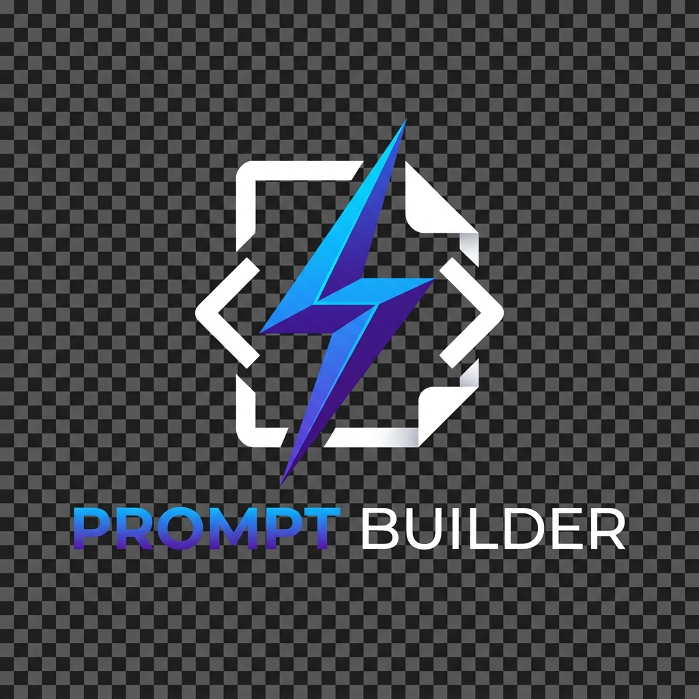
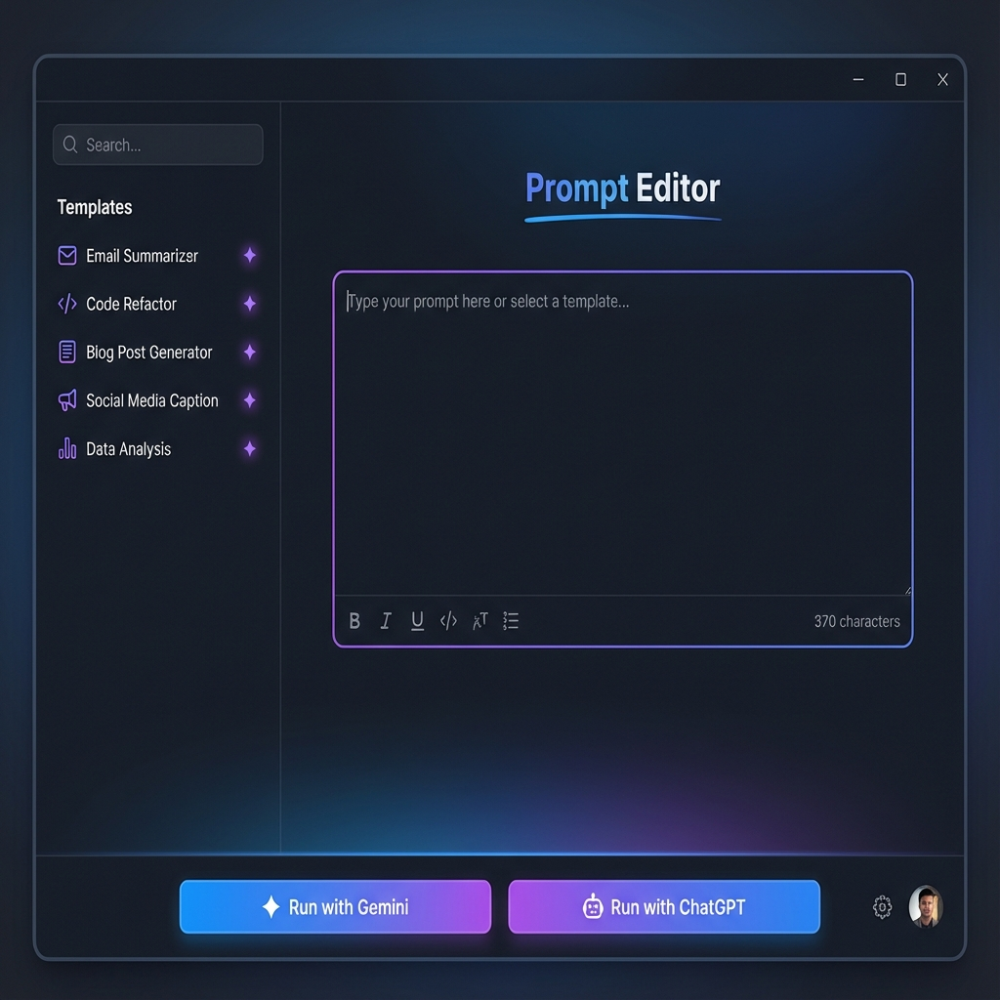

# Prompt Builder

<p align="center">
  
</p>


**Prompt Builder** is an Electron-based desktop application designed to interactively build, test, and manage AI prompts. Whether you are crafting complex system instructions for ChatGPT, optimizing queries for Google Gemini, or organizing a library of reusable prompt templates, Prompt Builder streamlines the workflow.

## 🚀 Features

*   **Interactive Prompt Building**: Visual interface to construct and edit prompts.
*   **Multi-LLM Support**: Test prompts directly against Google Gemini (setup required) and other LLMs.
*   **Cross-Platform**: Runs seamlessly on Windows, macOS, and Linux.
*   **Template Management**: Save and organize your favorite prompt recipes.
*   **Guest Mode**: Quick testing without complex API key setup for supported services.

## 📦 Installation

Prerequisites: [Node.js](https://nodejs.org/) (v18+) and [Git](https://git-scm.com/).

1.  **Clone the repository:**
    ```bash
    git clone https://github.com/gogogadgetscott/prompt_builder.git
    cd prompt_builder
    ```

2.  **Install dependencies:**
    ```bash
    npm install
    ```

3.  **Start the application:**
    ```bash
    npm run start
    ```
    *(Note: `npm run dev` is also available for development with hot-reload)*

## 🖼️ Usage

1.  **Launch the App**: Run `npm run start` to open the Prompt Builder window.
2.  **Select a Mode**: Choose between different LLM contexts or the generic "Guest Mode" for quick testing.
3.  **Build Your Prompt**: Use the editor to type your prompt. Use the sidebar to load saved "recipes" or templates.
4.  **Test**: Click "Run" to test the prompt against the connected AI service (requires configuration).



## 🤝 Contributing

We welcome contributions! Please see [CONTRIBUTING.md](CONTRIBUTING.md) for details on how to submit pull requests, report issues, and verify your changes.

## 🗺️ Roadmap

Check out our [ROADMAP.md](ROADMAP.md) to see what's planned for future releases, including:
*   Prompt Libraries
*   VS Code Extension
*   Community Sharing Features

## 📄 License

This project is licensed under the MIT License.
